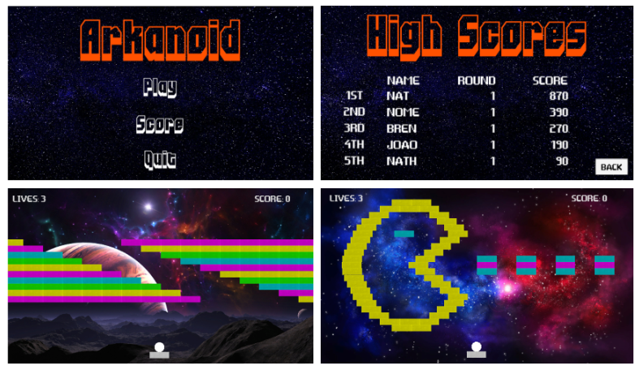
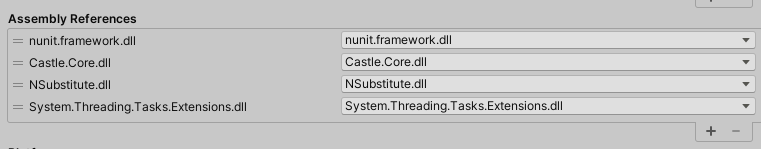

[](https://github.com/NathalyaStefhany/IC-2020/actions)
[](https://simmer.io/@phillima/arkanoid)


# Arkanoid

Repository dedicated to the project "Towards Automated Playtesting in Game Development". 
The paper was published at the Brazilian Symposium on Games and Digital Entertainment - SBGames 2021, on the Computing Track - Short Paper.
[Link to the paper](https://sol.sbc.org.br/index.php/sbgames_estendido/article/view/19666)

<p align="center">
  
</p>

## Descrição
O objetivo do projeto é aplicar técnicas da engenharia de software moderna como:

- Padrões de Projeto.
- Testes de Unidade.
- Versionamento.
- Integração Contínua.

O projeto está sendo desenvolvindo na linguagem C#, utilizando a game engine Unity e IDE Microsoft Visual Studio.

## Funcionalidades
A aplicação conta com algumas funcionalidades já implementadas:
- [x] Cadastro do nome do jogador.
- [x] Duas fases.
- [x] Tabela de pontuação.
- [x] Power Up que aumenta a quantidade de dano da bola.

## Ferramentas
As seguintes ferramentas estão sendo utilizadas na construção do projeto:
- [Unity](https://unity.com/)
- [Visual Studio](https://visualstudio.microsoft.com/pt-br/vs/)
- [Unity Test Runner](https://docs.unity3d.com/2017.4/Documentation/Manual/testing-editortestsrunner.html)
- [NUnit](https://nunit.org/)
- [Github Actions](https://github.com/features/actions)
- [NSubstitute](https://github.com/nsubstitute/nsubstitute)

## Como utilizar?
### Requisito
- Unity (Versão 2018.4.18f1)

### Clone
Clone este repositório na sua máquina local.
```sh
git clone https://github.com/NathalyaStefhany/IC-2020.git
```

### Adicionar as depêndencias do NSubstitute
Como a biblioteca NSubstitute não é gerenciada pelo Unity Package Manager, será necessário adicionar as depêndencias manualmente. O repositório já contém os arquivos necessários. 
- Acesse o diretório PlayModeTests.
- Abra o arquivo PlayModeTests.asmdef no Inspector
- Adicione as 3 dependências conforme a Figura abaixo:
  - Castle.Core.dll
  - NSubstitute.dll
  - System.Threading.Tasks.Extensions.dll

<p align="center">
  
</p>


### Unity
- Abra o projeto no Unity.
- Clique no ícone `Play` para rodar o jogo.

### Unity Test Runner
- Vá em `Window > General > Test Runner` para executar os testes. 
  - Será aberto uma nova tela `Test Runner` e nela teremos duas opções de suítes de teste (PlayMode e EditMode).
  - Para executar os testes temos três opções: `Run All`, `Run Selected` e `Rerun Failed`.
